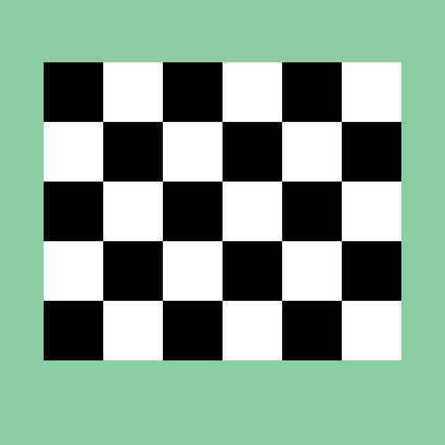
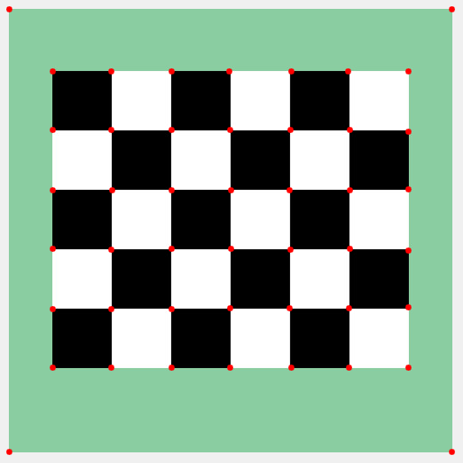

# Harris Corner Detection

## Algorithm
1. Get gaussian's first derivative
2. Compute x and y derivatives of image
3. Compute products of derivatives at every pixel
4. Define H on each pixel, calculate corner response
5. Apply threshold and non-maximum suppresion

## Demo: input and output

## Reference
[https://github.com/gokhanozbulak/Harris-Detector](https://github.com/gokhanozbulak/Harris-Detector)

[http://www.cse.psu.edu/~rtc12/CSE486/lecture06.pdf](http://www.cse.psu.edu/~rtc12/CSE486/lecture06.pdf)